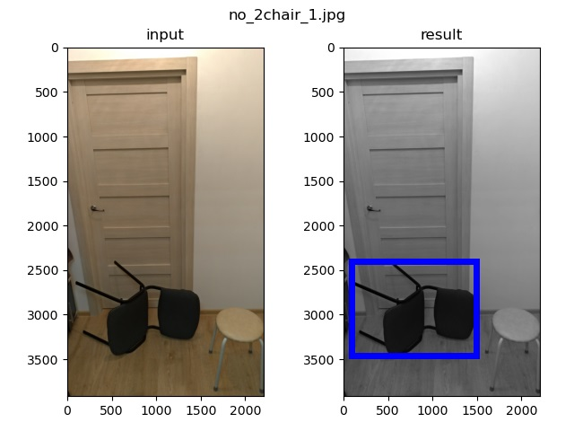
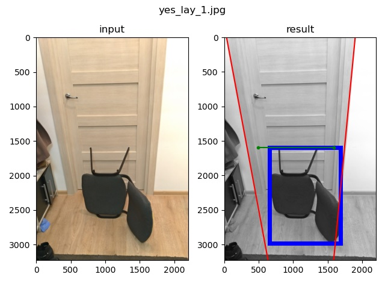

# Большая лабораторная по предмету "обработка сигналов" # 
Задача: определить возможно ли пронести объект(стул) через проём (дверь) 

## Постановка задачи ## 
Вход: изображение, на котором присутствует только объект А (стул) и Б (дверной проём) 
Выход: "да"/"нет" 
"да" - в данной ориентации стул А проходит в дверной проём Б 
"нет" - в данной ориентации стул А не проходит в дверной проём Б 

## Требования к изображению: ## 
### Общие
* На изображении должны присутствовать и стул, и дверной проём 
* Ближняя (к дверному проёму Б) ножка стула находится не далее, чем на 20см от проёма Б 
* Обработка изображения (фильтры, яркость и т.д.) не должны препятствовать распознаванию контуров стула и двери глазом человека 
* На изображении отсутствуют объекты, препятствующие распознаванию внешних контуров полотна двери и стула 
* Изображению снято на камеру не менее 3.1 Мп 
* Формат изображения: .jpg 
### Для текущей реализации
* На верхней половине изображения должна присутствовать дверь
* Каждый боковой дверной косяк должен составлять 1/9 от ширины дверного проёма
* Дверь может влезать на фотографию не целиком. Но обрезана она может быть только верхним или нижним краями фотографии.
* Дверной проём должен располагаться вертикально
* Стул должен являться самым большим по площади темным объектом
* Стул не должен пересекаться с другими тёмными объектами
* Допускаются шумы из меньших по размеру чем стул тёмных объектов

## Датасет и разметка ## 
Данные находятся в папке "dataset" 
префикс: 
* yes - объект проходит в дверной проём 
* no - объект не проходит в дверной проём 
* undef - некорректное изображение 
также в имени файла может содержаться краткое описание, в случае совпадения префикса и описание добавляется нумерация

## Инструкция по запуску ##
Склонировать/скачать репозиторий на локальную машину.
Выполнить команду pip install -r requirements.txt в консоли.

### Зависимости
* Версия Python 3.7x
* Модули
  * matplotlib
  * numpy
  * opencv-python
  * scikit-image
  * imageio
  
### Запуск
Команда запуска в командной строке OS Windows:
python main.py

#### Параметры:

1. -h — справка по параметрам
2. -p — путь до директории, где лежат входные изображение (по умолчанию равен "tests/'mode')
3. -m — режим работы:
   * "door" - поиск только двери
   * "chair" - поиск и определение ширины только стула
   * "common" - поиск стула, двери и определения их ширины
3. -o — вывод изображении с результатами алгоритма;
4. -d — детальный вывод промежуточных результатов алгоритма:

# Хронология и реализация
По сути задача состоит из трёх частей:
1. Нахождение дверного проёма
2. Нахождение стула
3. Определение размеров дверного проёма, стула и их сравнение с выдачей результата

# Итерация 1
Более подробно про первую итерацию можно прочесть в "First_iter/Big_Lab_Report.ipynd"

В этой итерации предполагался поиск стула и двери на основе особых точек. Данный метод позволял избавиться от перспективы. Однако, он требовал шаблонов двери шаблонов и двери и стула.
 
Выяснилось, что поиск двери по особым точкам сильно затруднён. Проблема состоит в том, что дверь имеет слишком мало особенностей, часть из которых ещё и перекрывается стулом. А неверное нахождение двери даёт неверное пространственное преобразование. После чего вся дальнейшая обработка изображения уже не имеет смысла.

Поиск стула, как казалось, давал весьма сносные результаты. Но важно понимать, что в первой итерации использовались только по одному шаблону для стула и для двери (не вставал вопрос выбора наиболее подходящего шаблона).

### Поиск двери
Имеется шаблон двери.
После нахождения особых точек для двери и их соотнесение с особыми точками шаблона строится пространственное преобразование (при помощи cv2.findHomography). Зная преобразование, избавляемся от перспективного искажения двери (методом cv2.warpPerspective).

Шаблон двери

Пример нахождения двери и избавление от перспективы

### Поиск стула
Имеется шаблон стула, по которому найдена маска стула.
Аналогично поиску двери, определяем преобразования и, применяя его к маске стула, получаем маску на исходном изображении. Далее к этой маске применяем тоже пространственное преобразование, что и к двери. Это позволяет нам получить маску стула на изображении без перспективы.

Шаблон стула:

Пример определения стула (несколько изображений)

### Определение ширины
Уже имеется:
  * Изображение двери без перспективы
  * Маска стула без перспективы

ширина - горизонтальное расстояние между самой правой и самой левой точками объекта
Высота стула и двери не учитывается. Считаем, что высота двери всегда много больше высоты стула
Если ширина двери больше или равна ширине стула ответ - "yes" иначе ответ - "no"

Примеры результатов алгоритма

Всё выделено верно

Неверно найдено преобразование для дверного проёма

# Итерация 2

### Поиск двери
Так как пришлось полностью отказаться от особых точек, то было решено использовать преобразование Хафа для нахождения прямых на изображении.

Уже сразу было понятно, что все "точно не вертикальные" прямые можно не рассматривать. Но вертикальных прямых всё ещё было в избытке (дверной проём, дверной косяк, ножки стула). Потому решено искать дверь только в верхней половине изображения.

К сожалению, нет никакой гарантии что определятся обе (внешняя и внутренняя) границы дверных косяков, потому решено искать самую правую и самую левую прямые. Далее учтём то, что каждый дверной косяк составляет 1/9 от ширины проёма и сузим итоговую ширину проёма на величину дверных косяков.

Пример хорошего выделения

Пример плохого выделение (смазанное изображение)

### Поиск Стула
Сначала была попытка расширить алгоритм на основе особых точек. Но появилась проблема выбора шаблона. Особы точки стула обнаруживались на предметах окружения (такие как ручки двери, дверцы прихожей) лучше, чем на самом стуле. Из-за чего лучшим шаблоном считался тот, на котором стул был больше всего похож на фон.
(изображения с примерами)

Ожидание:

Реальность

В итоге лучшее совпадение шаблона

Удаление заднего фона только усугубляет ситуацию.

Ожидание:

Реальность

В итоге лучшее совпадение шаблона

Пришлось отказаться от использования особых точек. 

Учитывая то, что стул чёрный, а фон светлый осуществим поиск стула путём бинаризации изображения по интенсивности.
Для бинаризации используется порог skimage.filters.threshold_minimum
Для удаления шумов используем "размытие" и морфологические операции открытия и закрытия.
После бинаризации и удаления шумов выделяем компоненту связности с наибольшей площадью. Тут появляется ряд проблем:
* Стул не всегда является максимальной по площади компонентой (например, на фотографии присутствует чёрный ковёр)
* Стул пересекается/касается другого тёмного объекта (они объединяются в одну компоненту)
Все эти проблемы решаются путём добавления дополнительных требований к входному изображению

Пример верно найденного стула

Примеры неверно найденного стула (тёмный ковёр по плащади больше стула)

### Определение ширины
Уже имеется:
  * Две прямые-образующие дверного проёма
  * Прямоугольник, описывающий маску стула

Ширина двери – горизонтальное расстояние между прямыми
Так как образующие дверного проёма не параллельны, то определять ширину двери будем на уровне верхней границы стула.

Ширина стула вычисляется как ширина описывающего его прямоугольника

Высота стула и двери не учитывается. Считаем, что высота двери всегда много больше высоты стула

Если ширина двери больше или равна ширине стула ответ - "yes" иначе ответ - "no"

Примеры результатов алгоритма
* красные прямые - образующие двери
* зелёная прямая - расстояние по которому вычислена ширина дверного проёма
* синяя рамка - рамка, описывающая стул

    
    no_ok_2.jpg
    door`s width  = 922
    chair`s width = 1364
    Answer is no
    Correct
    
тут помешали нижние ножки стула, из-за которых он кажется шире

    yes_hard_1.jpg
    door`s width  = 896
    chair`s width = 972
    Answer is no
    Incorrect

    
    yes_lay_1.jpg
    door`s width  = 1099
    chair`s width = 1031
    Answer is yes
    Correct

    
    yes_ok_4.jpg
    door`s width  = 1086
    chair`s width = 831
    Answer is yes
    Correct

    
    yes_ok_3.jpg
    door`s width  = 1668
    chair`s width = 818
    alt width = 987
    Answer is yes
    Correct

В некоторых случая даже шум не мешает распознаванию объектов

    no_2chair_overlap_1.jpg
    door`s width  = 966
    chair`s width = 1389
    Answer is no
    

